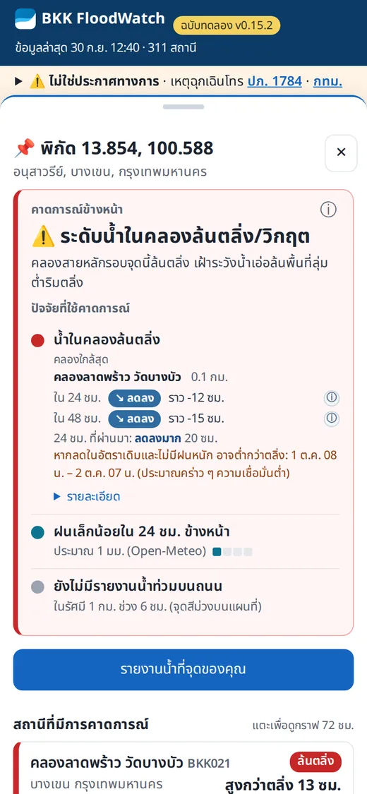
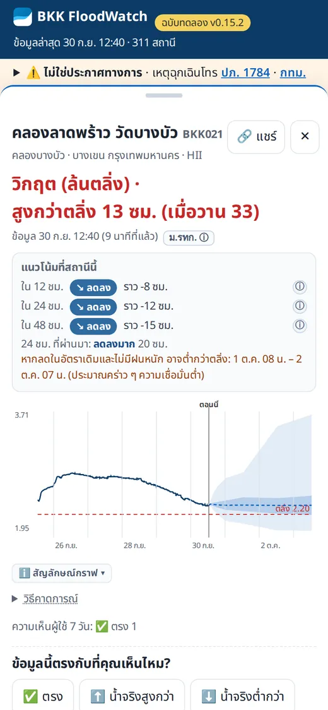
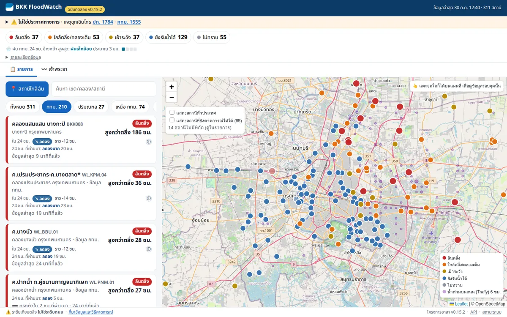
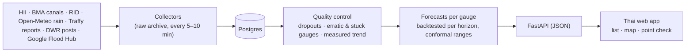

# BKK FloodWatch — Thailand flood and water-level monitor 🌊

**ติดตามระดับน้ำคลองและแม่น้ำกว่า 1,000 สถานีทั่วประเทศ เทียบตลิ่ง พร้อมคาดการณ์ 12–48 ชั่วโมง**
Real-time water levels of canals and rivers across Thailand — 1,000+ gauges from HII, RID, EGAT and BMA, compared with the bank, with backtested 12–48 h forecasts — in plain Thai, on your phone. It started in Bangkok during the 2026 flood (hence the name) and covers the whole country since v0.16.

**[▶ Open the app — flood.autobahn.bot](https://flood.autobahn.bot)** · [API docs](https://flood.autobahn.bot/api/docs) · [Changelog](CHANGELOG.md) · [Handoff (for developers)](HANDOFF.md)

[](https://flood.autobahn.bot)
[](https://github.com/bejranonda/flood2026/releases)
[](LICENSE)
[](pyproject.toml)

> [!WARNING]
> **Not an official warning service · ไม่ใช่ประกาศทางการ.** Always follow BMA, DDPM, RID and HII announcements.
> Emergency: **กทม. 1555** · **ปภ. 1784**. A gauge measures the canal, not your street or your house.

<p align="center">
  
  
</p>
<p align="center">
  
</p>

## What it answers
| You ask | The app shows |
|---|---|
| **น้ำแถวบ้านจะขึ้นหรือลง?** Is the water near me going up or down? | Tap any place (or "สถานีใกล้ฉัน"): the nearest canal gauge, its status against the bank, what it did in the last 24 h ("ลดลง 20 ซม.") and its 24/48 h trend ("↘ ลดลง ราว −12 ซม."), rain in the next 24 h and street-flood reports around you. |
| **ไม่เข้าใจตัวเลข** I don't get the numbers | Every pin has a plain line under its headline, and one button "✨ ให้ AI สรุปให้ฟังง่าย ๆ": renders instantly (<50ms) from deterministic rule lines without waiting, then polishes into a warm, natural Thai spoken narrative (GLM) in the background, with an audio readout button ("🔊 ฟังเสียง") for voice accessibility, and the numbers folded under "ดูตัวเลข". The rules write the story; the AI may only retell it after a strict check. |
| **เมื่อไหร่น้ำจะลด?** When will it drop below the bank? | A date range with its conditions ("หากลดในอัตราเดิมและไม่มีฝนหนัก … ความเชื่อมั่นต่ำ"), never a minute countdown. |

## Features
- **Every gauge, one honest story — now nationwide.** About **1,040 gauges** (≈ 210 in Bangkok, 830 across the country): HII, RID, EGAT, the Thai Red Cross volunteer network (พพภ.) and all **199 BMA canal gauges**, every 5–10 minutes. Two pickers, **ภาค** (กทม. · กทม. และปริมณฑล · ภาคกลาง · ภาคเหนือ · ภาคอีสาน · ภาคตะวันออก · ภาคตะวันตก · ภาคใต้ · ทั่วประเทศ) and **จังหวัด**, filter the counts, list, map and river views. The headline, the rows and the list always say the same thing — checked before each release.
- **A few centimetres count.** Each gauge shows what the water did in the last 24 h (or 48 h for slow changes) in plain words (ลดลงเล็กน้อย / ลดลง / ลดลงมาก), and the bank distance today vs yesterday.
- **Forecasts that earn their place.** Every gauge is backtested for each horizon with a year of history, rain for its own area and the gauges upstream of it; a model is used only where it beats "no change". Every model change is tested honestly — chosen on one half of the backtest, scored on the other, confirmed on gauges it never saw — and the record of what helped and what did not is in [docs/MODELS.md](docs/MODELS.md) §5d. Otherwise the rows follow the measured trend, and the ⓘ says how often such a trend continued in the past (canals ≈ 5–6 in 10, rivers ≈ 9 in 10).
- **Plain words, instant AI helper and voice readout.** Each pin, **each station sheet (with the rain measured nearby and forecast) and the ⚠️ จับตา tab (the overview, the most critical gauges first)** has one button that opens an instant plain-Thai summary (zero-wait UX: deterministic rule narrative renders immediately; GLM's warm retelling polishes it in the background). Strict safety checks ensure no invented numbers or safety verdicts. Includes a "🔊 ฟังเสียง" voice readout for elderly and visually impaired residents via the Web Speech API. Works completely without AI (`AI_EXPLAIN=0`).
- **Bad data is hidden, not shown as fact.** Single-reading dropouts are removed; gauges next to pumps or with stuck sensors keep their dot and chart, but not a level or a trend.
- **Built for a phone during a flood.** Thai first, short panels, place search (ซอย/ถนน/ย่าน), map, **river views for 62 waterways** (every natural river with ≥ 3 gauges): pick ภาค · จังหวัด · แม่น้ำ, see each river from upstream (top) to downstream with every gauge's 24 h forecast, or the "ทุกสาย" overview of a region's rivers; each station links to its river, share links, and a one-tap water report from where you are.
- **What to watch, at a glance.** The ⚠️ จับตา tab lists the next 24–48 h risks: over the bank and may reach the bank (each split into still rising / steady or falling, as coloured pills), water coming from upstream, fast rises and heavy rain — each with the app's own track record ("6 ใน 10"). A running ticker in the top bar sums up all of Thailand every 30 minutes as short items with symbols (🔴 over the bank and rising · 🏙️ Bangkok · 🏞️ the Chao Phraya Dam release and the flow at Nakhon Sawan · 🌧️ rain …), each item retold in plain Thai by AI only after it passes a check against its own fact.
- **Every status in two dimensions.** How full (ล้นตลิ่ง · ใกล้ตลิ่ง · เฝ้าระวัง · ยังรับน้ำได้) and where it is going (น้ำยังขึ้น / ทรงตัวหรือลดลง: the forecast when it is sure, the measured recent change otherwise), the same everywhere; forecasts 24, 48 and 72 h ahead.
- **Open.** MIT-licensed code and a free, key-less JSON API.

## How it works

One server with `docker compose`, published through a Cloudflare Tunnel (no open ports). Models and formulas: [MODELS](docs/MODELS.md) · methods: [APPROACH_AND_METHODS](docs/APPROACH_AND_METHODS.md) · design: [ARCHITECTURE](docs/ARCHITECTURE.md).

## Data sources
| Source | What we use | Status |
|---|---|---|
| [HII ThaiWater](https://www.thaiwater.net) (สสน.) | Water levels, banks, discharge, rain gauges; up to a year of hourly history; official forecasts (archived and scored) | ✅ live |
| BMA canal gauges (สำนักการระบายน้ำ กทม.) | 199 Bangkok gauges every 5 min via the public KlongMap relay; a year of history for 158 from HII | ✅ live |
| RID (กรมชลประทาน), EGAT (กฟผ.), พพภ. | River gauges across Thailand and the Chao Phraya Dam release, via HII | ✅ live |
| Open-Meteo | Rain forecast, and rain as it was forecast 1–2 days earlier (for honest backtests): Bangkok points and a 0.5° cell for every other gauge | ✅ live |
| Traffy Fondue | Street-flood reports around each gauge (counts only) | 🟡 often overloaded; age shown |
| OpenStreetMap Nominatim | Place search, on request only (queries are never stored) | ✅ live |
| Google WeatherNext 3 (DeepMind) | 64-member AI weather forecasts; subscribed via BigQuery Analytics Hub (`weathernext_3`), live queries verified (D-069, research/backtesting only; real-time rain is never shown or served per terms) | 🔬 connected / research only ([D-069](docs/plan/DECISIONS.md)) |
| GISTDA, Copernicus GFM (satellite flood maps), GloFAS | Tested 2026-10-02: satellites are blind among Bangkok's buildings, GloFAS adds nothing to a 3–7 day outlook here | 🔬 research only ([D-069](docs/plan/DECISIONS.md)) |
| Google Flood Hub (Flood Forecasting API) | 103 river points in Thailand: flood status, thresholds, 9-day discharge; collected every 6 h and compared with our gauges | 🔬 validating, not shown ([D-087](docs/plan/DECISIONS.md)) |
| DWR early-warning posts (กรมทรัพยากรน้ำ) | 455 village level posts; local datum, so shown as measured change only | ✅ trend-only map layer ([D-081](docs/plan/DECISIONS.md)) |

Full registry, including endpoints that were tested and refuted: [SOURCES](docs/SOURCES.md).

## For developers
### Free JSON API (no key)
| Endpoint | Returns |
|---|---|
| `GET /api/point?lat=&lon=` | Outlook for a place: nearest canal, its measured and forecast change, rain, street reports |
| `GET /api/stations` | All focus gauges with status, bank distance, measured 24 h change and 12/24/48 h trend |
| `GET /api/stations/{code}?days=7` | One gauge: history and forecast path |
| `GET /api/profile` | Chao Phraya profile by river km |
| `GET /api/reports` · `/api/rain` · `/api/health` | Street-report cells · rain outlook · pipeline freshness |

```bash
curl -s "https://flood.autobahn.bot/api/point?lat=13.8545&lon=100.588"
```
Response, trimmed (live, 2026-09-30 05:38 UTC):
```json
{
  "forecast": {"risk": "high", "title": "ระดับน้ำในคลองล้นตลิ่ง/วิกฤต",
               "desc": "คลองสายหลักรอบจุดนี้ล้นตลิ่ง เฝ้าระวังน้ำเอ่อล้นพื้นที่ลุ่มต่ำริมตลิ่ง"},
  "area": {"category": "critical", "confidence": "medium", "nearest_km": 0.1, "n": 27},
  "nearest_canal": {"code": "BKK021", "distance_km": 0.1, "status": "critical",
                    "observed24": {"change_cm": -20, "level": "strong_fall", "hours": 24},
                    "change24": {"dir": "falling", "level": "fall", "median": -0.12, "basis": "measured_trend"}},
  "rain_next24_mm": 1.4,
  "evidence": {"traffy_flood_reports_1km_6h": 0}
}
```
Interactive docs: [`/api/docs`](https://flood.autobahn.bot/api/docs). Please keep requests reasonable; the payloads refresh once a minute.

### Run it yourself
```bash
cp .env.example .env          # set POSTGRES_PASSWORD (and Cloudflare values only if you publish)
docker compose up -d --build  # db, worker, app  (add --profile public for the tunnel)
docker compose run --rm --no-deps worker pytest -q      # 104 tests
python3 scripts/ux_consistency.py                        # UI consistency proof (Playwright), ~12 min
```
No data API keys are needed for basic monitoring. Secrets live only in `.env` (git-ignored). Operations, deploys and next steps: [HANDOFF](HANDOFF.md).

## Project status
Live since 2026-09-26, built during the 2026 flood; current release in the badge above. v0.16 (2026-09-30) brought every gauge in Thailand to the same history, forecast gate and panels as Bangkok. Next: an external uptime alert, the nationwide backtest once the year of history is in, dam releases for dam-controlled rivers, polder-aware "near me", and alerts for a saved place. Roadmap and decisions: [PLAN](docs/plan/PLAN.md) · [DECISIONS](docs/plan/DECISIONS.md).

## Documentation
| Doc | For |
|---|---|
| [HANDOFF](HANDOFF.md) | What is live, how to operate it, what to do next |
| [KNOWLEDGE](docs/KNOWLEDGE.md) | The "three waters", datums, stations, polders, the 2026 event |
| [MODELS](docs/MODELS.md) | **How the app calculates** (Thai summary + English): formulas, parameters, which models win, hard cases, what we tried and why, data wish-list |
| [APPROACH_AND_METHODS](docs/APPROACH_AND_METHODS.md) | QC, forecasts, backtests, conformal ranges, point check |
| [ARCHITECTURE](docs/ARCHITECTURE.md) · [SOURCES](docs/SOURCES.md) | System design · every data source and its test status |
| [KNOWN_ISSUES](docs/KNOWN_ISSUES.md) · [GUIDELINES](docs/GUIDELINES.md) | Pitfalls with status (KI-IDs) · rules for code, data and UX |
| [UX_VALIDATION](docs/UX_VALIDATION.md) · [OWNER_ACTIONS](docs/OWNER_ACTIONS.md) | Resident checks and findings · what the project needs from its owner |
| [docs/README](docs/README.md) | Full index and reading order |

## FAQ
<details><summary><b>ข้อมูลมาจากไหน? · Where does the data come from?</b></summary>

สถานีวัดน้ำของ สสน. (HII), กรมชลประทาน และสำนักการระบายน้ำ กทม. ฝนคาดการณ์จาก Open-Meteo และรายงานน้ำท่วมจาก Traffy Fondue — official gauges plus open rain and citizen-report feeds; see [Data sources](#data-sources).
</details>
<details><summary><b>ใช้นอกกรุงเทพฯ ได้ไหม? · Does it work outside Bangkok?</b></summary>

ได้ ตั้งแต่ v0.16 ทุกสถานีของ สสน. กรมชลประทาน และ กฟผ. ทั่วประเทศ ใช้กฎเดียวกับกรุงเทพฯ แตะ "อีสาน" "ใต้" หรือจุดใดก็ได้บนแผนที่ — yes: since v0.16 every HII/RID/EGAT gauge in Thailand follows the same rules as Bangkok. Pick a region chip or tap any place; outside Bangkok the panel speaks of the rivers near you.
</details>
<details><summary><b>บอกได้ไหมว่าบ้านฉันน้ำท่วมกี่เซนติเมตร? · Can it tell the depth at my house?</b></summary>

ไม่ได้ สถานีวัดระดับน้ำในคลองเทียบตลิ่ง ไม่ใช่ระดับบนถนนหรือในบ้าน แอปจึงบอกสถานะคลองใกล้คุณ แนวโน้ม และรายงานน้ำท่วมรอบจุด — No: a gauge measures the canal against its bank, so the app shows the nearest canal, its trend and nearby reports, never a depth at your pin.
</details>
<details><summary><b>แม่นแค่ไหน? · How accurate are the trends?</b></summary>

ทุกสถานีทดสอบย้อนหลังแยกตามช่วงเวลา ใช้แบบจำลองเฉพาะที่แม่นกว่า "ถือว่าน้ำคงที่" ปุ่ม ⓘ บอกความมั่นใจและโอกาสที่แนวโน้มจะเป็นต่อ — every gauge is backtested per horizon; the ⓘ next to each row gives the confidence or the historical odds.
</details>
<details><summary><b>ทำไมบางสถานีไม่แสดงระดับน้ำ? · Why is a gauge shown without a level?</b></summary>

ค่าผิดปกติ เช่น ขึ้นลงเร็วเพราะการสูบน้ำใกล้เครื่องวัด หรือค่าค้างที่เดิม จะถูกซ่อนพร้อมหมายเหตุ แต่สถานียังอยู่บนแผนที่ — values that jump (pumps next to the sensor) or stay stuck are hidden with a note; the gauge stays on the map.
</details>
<details><summary><b>ใช้ข้อมูลต่อได้ไหม? · Can I reuse the data or the code?</b></summary>

โค้ดเป็น MIT และมี API ฟรี ข้อมูลของแต่ละหน่วยงานเป็นไปตามเงื่อนไขของหน่วยงานนั้น — the code is MIT and the API is free; third-party data keeps its own terms ([SOURCES](docs/SOURCES.md)).
</details>

## Contributing
Issues and pull requests are welcome: [open an issue](https://github.com/bejranonda/flood2026/issues). Please read [GUIDELINES](docs/GUIDELINES.md) first (evidence rule, no secrets, short panel text) and run the tests.

## License and attribution
Code: [MIT](LICENSE). Data: HII/สสน., RID/กรมชลประทาน, BMA/กทม., DWR/กรมทรัพยากรน้ำ, TMD, Traffy Fondue, Google Flood Hub (validation only), Open-Meteo / Copernicus GloFAS, OpenStreetMap contributors — each under its own terms. Official contacts: กทม. **1555** · ศูนย์ป้องกันน้ำท่วม กทม. **02-248-5115** · ปภ. **1784** · กรมชลประทาน **1460** · [thaiwater.net](https://www.thaiwater.net).
